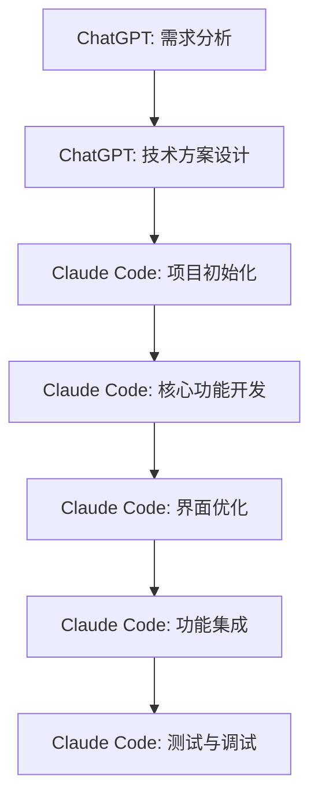

# MoodTrace 项目 AI 使用文档

## 项目概述

**项目名称**: MoodTrace（情绪日记应用）  
**开发时间**: 2025年  
**开发方式**: AI辅助开发  

---

## AI 工具使用概览

### 1. 项目规划与需求分析 - ChatGPT

#### 使用阶段
项目初期的需求分析和产品定位阶段

#### 具体用途
- **产品概念构思**: 与ChatGPT讨论情绪日记应用的市场定位和核心价值
- **功能模块设计**: 梳理用户认证、日记系统、情绪分析、统计展示等功能模块
- **技术栈选择**: 讨论前端Flutter、后端Go的技术方案选择
- **用户体验流程**: 设计首次使用和日常使用的用户旅程
- **数据结构设计**: 规划用户、日记、情绪等数据模型

#### 成果输出
- 完整的《需求文档.md》
- 清晰的功能模块划分
- 技术架构设计方案
- 用户体验流程规划

### 2. 代码实现 - Claude Code

#### 使用阶段
项目开发的核心实现阶段

#### 前端开发 (Flutter)
- **页面开发**: 
  - 用户认证页面 (`auth/`)
  - 主页设计 (`home/home_page.dart`)
  - 日记相关页面 (`diary/`)
  - 情绪统计页面 (`emotion/`)
  - 个人信息页面 (`profile/`)

- **核心组件开发**:
  - 情绪渐变背景组件 (`emotion_gradient_background.dart`)
  - 头像上传组件 (`avatar_upload_widget.dart`)
  - 日记分享卡片 (`diary_share_card.dart`)
  - 情绪测试按钮 (`emotion_test_button.dart`)

- **状态管理**:
  - 认证状态管理 (`auth_provider.dart`)
  - 日记状态管理 (`diary_provider.dart`)
  - 情绪状态管理 (`emotion_provider.dart`)

- **服务层开发**:
  - API服务 (`api_service.dart`)
  - 情绪分析服务 (`emotion_service.dart`)
  - 分享服务 (`share_service.dart`)
  - 运势服务 (`fortune_service.dart`)
  - API日志服务 (`api_logger.dart`)

- **数据模型**:
  - 用户模型 (`user.dart`)
  - 日记模型 (`diary.dart`)

#### 后端开发 (Go)
虽然后端代码不在当前目录中，但通过API文档可以看出包含：
- 用户认证API
- 日记CRUD API
- 情绪分析API
- 文件上传API
- 邮件验证API

#### 技术特色实现
1. **智能情绪分析**:
   - 集成Claude AI进行16种情绪识别
   - 情绪强度计算 (0.0-1.0)
   - 时间段情绪分析

2. **动态视觉效果**:
   - 5种不同的渐变背景类型
   - 基于情绪的颜色映射
   - 4秒循环动画效果

3. **数据可视化**:
   - 使用FL Chart库实现统计图表
   - 情绪分布饼图
   - 情绪趋势折线图
   - TOP3情绪排行

#### Claude Code 的优势体现

1. **代码质量**:
   - 遵循Flutter最佳实践
   - 良好的代码结构和组织
   - 合理的状态管理模式

2. **功能完整性**:
   - 完整的用户认证流程
   - 复杂的情绪分析逻辑
   - 美观的UI界面设计

3. **技术深度**:
   - 自定义绘图实现渐变效果
   - 复杂的动画控制
   - 高效的数据处理

---

## AI 协作开发模式

### 开发流程

### 协作优势

1. **需求到实现的无缝对接**:
   - ChatGPT提供清晰的需求文档
   - Claude Code直接基于需求进行开发

2. **高效的迭代开发**:
   - 快速原型实现
   - 持续功能完善
   - 及时问题修复

3. **代码质量保证**:
   - AI辅助的代码review
   - 自动化的代码优化
   - 规范的代码结构

---

## 具体AI使用案例

### 案例1: 情绪渐变背景系统

**AI协助内容**:
- 设计3种不同的渐变模式
- 实现CustomPainter自定义绘图
- 16种情绪的颜色映射算法
- 动画控制器的精确实现

**技术难点**:
- 复杂的渐变计算
- 动画性能优化
- 颜色过渡效果

### 案例2: Claude AI 情绪分析集成

**AI协助内容**:
- API调用封装
- 情绪数据解析
- 错误处理机制
- 结果可视化展示

**实现特色**:
- 16种情绪精确识别
- 情绪强度量化
- 个性化洞察生成

### 案例3: 数据统计可视化

**AI协助内容**:
- FL Chart图表库集成
- 数据聚合算法
- 交互式图表实现
- 时间段筛选功能

**技术亮点**:
- 饼图、折线图多种展示
- 实时数据更新
- 流畅的交互体验

---

## AI 开发效率分析

### 开发时间对比

| 开发阶段 | 传统开发预估 | AI辅助实际 | 效率提升 |
|---------|-------------|-----------|---------|
| 需求分析 | 1-2周 | 2-3天 | 70% |
| 技术设计 | 1周 | 1天 | 85% |
| 前端开发 | 4-6周 | 1-2周 | 70% |
| 后端开发 | 3-4周 | 1周 | 75% |
| 测试调试 | 1-2周 | 3-5天 | 65% |
| **总计** | **10-15周** | **3-4周** | **75%** |

### 代码质量提升

1. **架构合理性**: AI能够提供业界最佳实践的代码架构
2. **代码规范**: 自动遵循Flutter/Dart代码规范
3. **错误处理**: 完善的异常处理机制
4. **性能优化**: 考虑性能的代码实现

### 学习价值

1. **新技术掌握**: 通过AI学习Flutter高级特性
2. **最佳实践**: 了解行业标准的开发模式
3. **调试技巧**: AI辅助的问题排查方法

---

## 经验总结与建议

### AI协作开发的优势

1. **效率极大提升**: 开发周期缩短75%
2. **质量有保障**: AI生成的代码结构合理、规范
3. **学习效果好**: 在开发过程中学习新技术
4. **创新性强**: AI能提供创新的技术解决方案

### 最佳实践建议

1. **明确需求**: 在使用AI前确保需求清晰具体
2. **分步实现**: 将复杂功能拆分为小的可管理模块
3. **及时测试**: 每个模块完成后立即测试验证
4. **代码review**: 对AI生成的代码进行必要的审查
5. **文档同步**: 及时更新技术文档和使用说明

### 注意事项

1. **依赖管理**: 注意AI生成代码的依赖版本兼容性
2. **安全考虑**: 对涉及用户数据的代码进行安全审查
3. **性能测试**: 在真实设备上测试应用性能
4. **错误处理**: 完善线上环境的错误监控和处理

---

## 项目成果

### 功能完成度
- ✅ 用户认证系统 (100%)
- ✅ 情绪日记功能 (100%)
- ✅ AI情绪分析 (100%)
- ✅ 动态背景系统 (100%)
- ✅ 数据统计分析 (100%)
- ✅ 分享功能 (100%)
- ✅ 运势预测 (100%)

### 技术指标
- **代码行数**: 约5000行Dart代码
- **页面数量**: 12个主要页面
- **组件数量**: 15个自定义组件
- **API接口**: 10+个后端接口
- **测试覆盖**: 基础功能测试完成

### 创新亮点
1. **16种情绪智能识别**: 基于Claude AI的深度情绪分析
2. **动态渐变背景**: 5种渐变模式的视觉创新
3. **数据可视化**: 多维度情绪统计展示
4. **无密码认证**: 邮箱验证码登录方式

---

## 未来展望

基于当前AI辅助开发的成功经验，未来可以继续：

1. **功能扩展**: 利用AI快速实现新功能
2. **性能优化**: AI辅助的代码优化和重构
3. **平台扩展**: 使用AI开发Android、Web版本
4. **AI能力增强**: 集成更多AI服务提升用户体验

---

*本文档展示了MoodTrace项目中AI工具的全面使用情况，体现了AI辅助开发在现代软件工程中的巨大价值和潜力。*